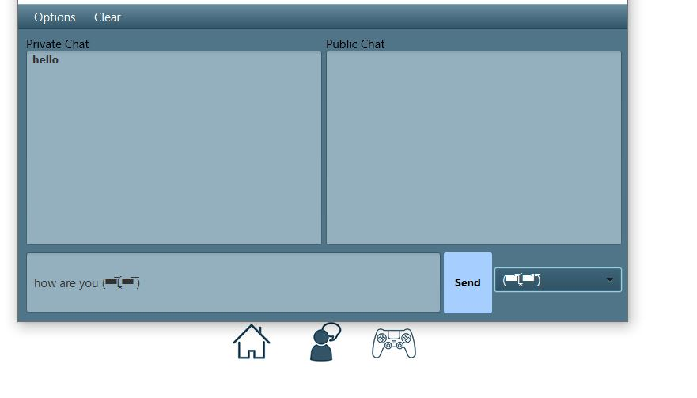
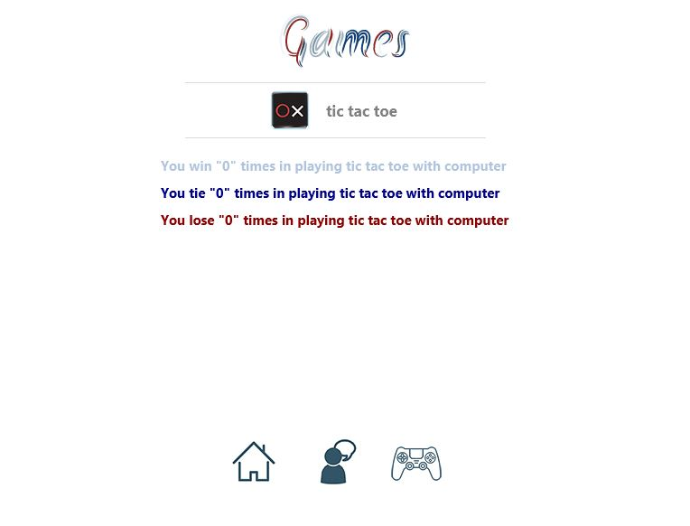

# Plato Plus

Plato Plus is the final project for an advanced programming course focusing on Object-Oriented Programming (
OOP) and Java at Ferdowsi University of Mashhad.

### Overview

This project is intended to be a small clone of Plato app which is a platform to play board game like games and chat with your friend.

###How to Run
1. run `network.ServerMain.java` to run the server.
2. run `menu.Start.java` to bring up the client side.

